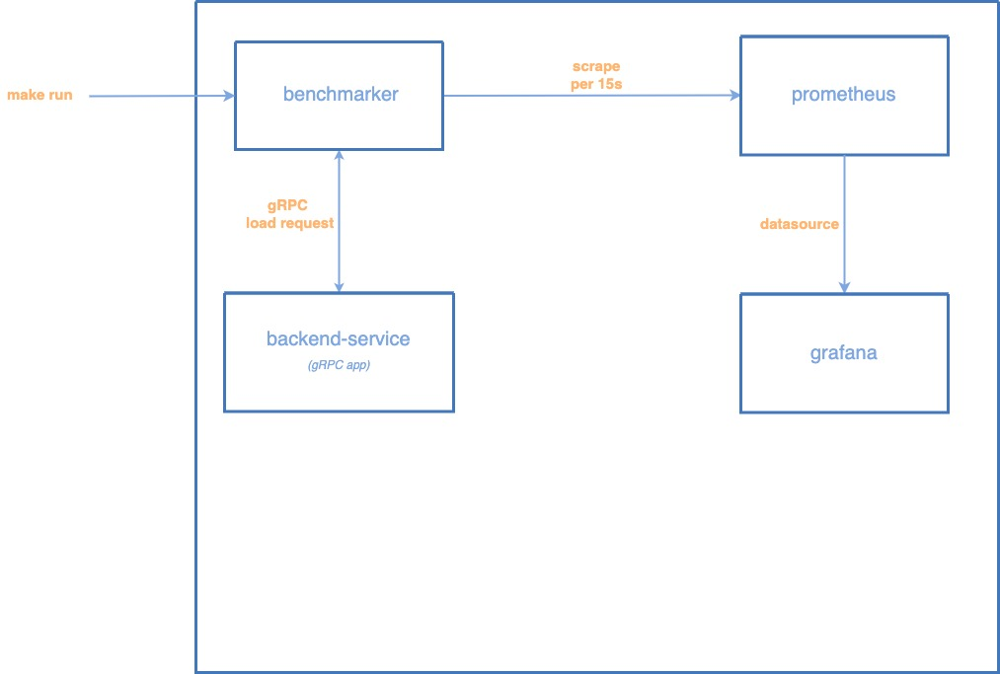

# benchmark-grpc

# Architecture



# Usage

Run containers:

```
docker-compose pull
docker-compose build
docker-compose up
```

Check the running containers:

```
docker-compose ps
```

output:

```
              Name                       Command         State           Ports
---------------------------------------------------------------------------------------
benchmark-grpc_backend-service_1   /go/backend-service   Up      0.0.0.0:8080->8080/tcp
```

Send gRPC request to gateway-service:

```
(cd backend-service && make run-client)
```

output:

```
2019/09/28 14:38:18 backend.Hello() message=success:<status_code:"0" >
```

containers' log:

```
backend-service_1  | time="2019-09-28T05:38:18Z" level=info msg="Hello()" func="main.(*backendServer).Hello" file="/app/main.go:88" request=
```