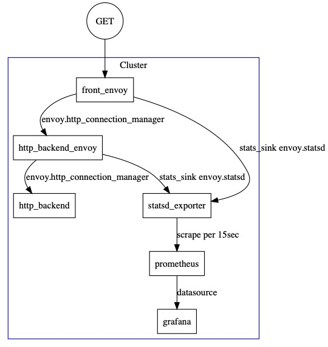

# envoy-prometheus-monitoring

The idea of this repository comes from https://github.com/dnivra26/envoy_monitoring

## Architecture



## Usage

### docker-compose

Run containers:

```
docker-compose pull
docker-compose build
docker-compose up
```

Send request to front-envoy, and see the response:

```
curl localhost:9000
```

output:

```
hello from http handler
```

### front-envoy admin

Open http://localhost:8001

> See front-envoy.yaml

### http-backend-envoy admin

Open http://localhost:8091

> See backend-envoy.yaml

### prometheus explorer

Open http://localhost:9090

> See docker-compose.yaml

### grafana dashboard

Open http://localhost:3000

> See docker-compose.yaml

### statsd_exporter 

Open http://localhost:9102

> See https://github.com/prometheus/statsd_exporter

## References

- statsd_exporter documentation https://github.com/prometheus/statsd_exporter
